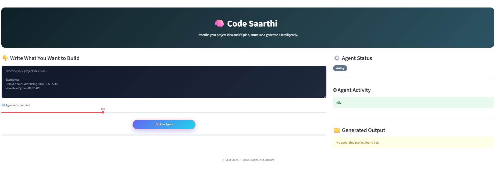

# 🤖 Code Saarthi — Agentic AI Engineering Assistant

Code Saarthi is an AI-powered agentic coding assistant built using **LangGraph** and the **Groq LLM API**.  
It behaves like a multi-agent software engineering team that converts natural language ideas into fully working projects — including folder structure, source files, and downloadable output.

Users interact through a clean **Streamlit UI**, control recursion depth dynamically, monitor agent activity in real time, and download the generated project as a ZIP file.

---

## ✨ Key Features

✅ Multi-agent architecture (Planner, Architect, Coder)  
✅ Natural language → Complete project generation  
✅ Dynamic recursion limit control from UI (10–300)  
✅ Real-time agent status, progress tracking & execution time  
✅ Automatic file and folder generation  
✅ One-click ZIP download of generated projects  
✅ Clean Streamlit dashboard  


---

## 🖥️ Demo — User Interface



---

## 🏗️ System Architecture


### 🧠 Agents Overview

- **Planner Agent**  
  Analyzes the user prompt and creates a high-level project plan.

- **Architect Agent**  
  Breaks the plan into structured engineering tasks and file-level context.

- **Coder Agent**  
  Generates real project files and folders using tool-based execution.

---

## ⚙️ Tech Stack

- Python  
- LangGraph  
- Groq LLM API  
- Streamlit  
- UV  

---

## 🚀 Getting Started

### ✅ Prerequisites

- Python 3.9+  
- UV installed  
- Groq API key  

---

### 📦 Installation

```bash
uv venv
source .venv/bin/activate
uv pip install -r pyproject.toml
